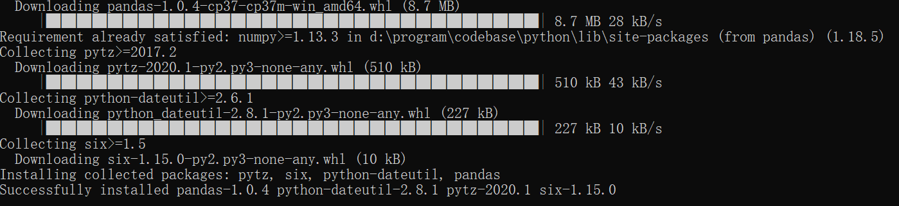

# task_aviationData
* This is a public data mining demo in course.Will show in my report.The project is a light data mining demo for aviation system to analys their guests.
* 这是课上要用的数据挖掘案例。将会在课堂上展示。本例为一个轻量级的数据挖掘程序，用于航空公司分析旅客。
## 引入模块（include model）
* pandas
```
pip install pandas
```

* numpy
```
pip install numpy
```
* sklearn
```
pip install scipy
pip install scikit-learn
```
* matplotlib
```
pip install matplotlib
```
## 主要方法（main method）
* 聚类分析（Cluster analysis）
* RFM模型（RMF Model）
* * RFMCL
## 问题（issue）
* 如果出现“ModuleNotFoundError: No module named 'openpyxl'”的问题，请重新安装openpyxl ：pip install openpyxl